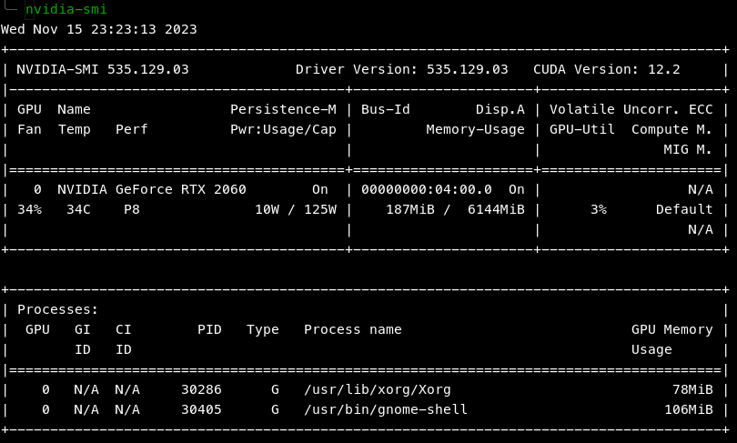
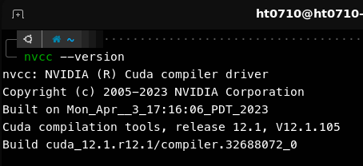

# <p align="center">How to install PyTorch</p>


## Introduction
Encountering difficulties running your deep learning model on a GPU? Here are step-by-step instructions on installing **PyTorch** with and without GPU (CUDA) support.

> **Note:**
> - Please follow the instruction carefully. Missing any step may damage the installation.
> - These instructions are specifically tailored for Linux environments, with or without an NVIDIA GPU.
> - If you're not planning to utilize GPU acceleration, feel free to skip the NVIDIA Driver and CUDA sections.
> - No need to separately install CuDNN, as PyTorch is bundled with its own version. Attempting to install it independently might inadvertently disrupt the PyTorch setup based on my past experience.
> ---


## Table of Contents
- [How to install PyTorch](#how-to-install-pytorch)
  - [Introduction](#introduction)
  - [Table of Contents](#table-of-contents)
  - [**Requirements**](#requirements)
    - [System](#system)
    - [Software](#software)
  - [**Preparation**](#preparation)
    - [**1. NVIDIA Driver (Optional)**](#1-nvidia-driver-optional)
      - [Method 1](#method-1)
      - [Method 2](#method-2)
      - [Verification](#verification)
    - [**2. Install CUDA (Optional)**](#2-install-cuda-optional)
      - [Verification](#verification-1)
    - [**3. Miniconda**](#3-miniconda)
      - [Verification](#verification-2)
  - [**Install PyTorch**](#install-pytorch)
      - [Verification](#verification-3)
  - [References](#references)
  - [Contact](#contact)


## **Requirements**
### System
```
- Ubuntu 18.04 or higher (64-bit)
- NVIDIA Graphics Card (Optional)
```

### Software
```
- Python 3.8–3.11
- NVIDIA GPU drivers version 450.80.02 or higher (Optional)i
- Miniconda (Optional)
```


## **Preparation**

> **Note:** If you're not planning to utilize GPU acceleration, skip the NVIDIA Driver and CUDA sections.

### **1. NVIDIA Driver (Optional)**

Check if you already have it [Verification](#verification)

If not, follow those step bellow (2 Method):

#### Method 1
> Easy! But sometimes error (Try method 2 if it's not work)
1. Install any pending updates
    ```bash
    sudo apt update && sudo apt upgrade -y 
    ```
2. Install all required packages
    ```bash
    sudo apt install build-essential libglvnd-dev pkg-config -y 
    ```
3. Blacklist nouveau
   > It does not work with CUDA and must be disabled
    ```bash
    sudo bash -c "echo blacklist nouveau > /etc/modprobe.d/blacklist-nvidia-nouveau.conf" 
    sudo bash -c "echo options nouveau modeset=0 >> /etc/modprobe.d/blacklist-nvidia-nouveau.conf" 
    ```
4. Remove old NVIDIA driver (optional)
    > Desktop maybe temporary at lower resolution after this step
    ```bash
    sudo apt-get remove '^nvidia-*' -y 
    sudo apt autoremove -y 
    reboot
    ```
5. Install nvidia driver
    ```bash
    sudo apt install nvidia-driver-535 -y 
    ```
6. The Nvidia driver is now installed. Reboot your system
    ```bash
    reboot 
    ```

#### Method 2
> Does this if method 1 is not work
1. Go to NVIDIA Driver Downloads site: https://www.nvidia.com/download/index.aspx?lang=en-us
2. Search for your GPU and then download it.
    > **Note:**
    > - If you using laptop, please choose `... (Notebook)` version for **Product Series**
    > - Remember to choose `Linux 64-bit` for **Operating System**

    **Example:**

    
3. Blacklist nouveau
   > It does not work with CUDA and must be disabled
    ```bash
    sudo bash -c "echo blacklist nouveau > /etc/modprobe.d/blacklist-nvidia-nouveau.conf" 
    sudo bash -c "echo options nouveau modeset=0 >> /etc/modprobe.d/blacklist-nvidia-nouveau.conf" 
    ```
4. Remove old NVIDIA driver (optional)
    > Desktop maybe temporary at lower resolution after this step
    ```bash
    sudo apt-get remove '^nvidia-*' -y 
    sudo apt autoremove -y 
    reboot
    ```
5. Install any pending updates
    ```bash
    sudo apt update && sudo apt upgrade -y 
    ```
6. Install all required packages
    ```bash
    sudo apt install build-essential libglvnd-dev pkg-config -y 
    ```
7. Install the driver:
    > Your driver version may higher than this instructions, those following command is an example.  
    > In case `*` in the file name doesn't work. **Please use `Tab` to autocomplete the file name.**
    1. Stop all display process. Your Screen will go black!!! **(Optional)**
        > For the smoothest installation
        1. Please continue viewing this on another device as you won't be able to do anything other than using the command lines.
        2. Stop the display driver
           ```bash
           sudo telinit 3
           ```
        3. Login with your username and password
        4. Continue the steps below
    2. Open terminal then navigate to your directory containing the driver
        ```bash
        # Example
        cd Downloads/
        ls
        # It must contain: NVIDIA-Linux-x86_64-xxx.x.x.run
        ```
    3. Give execution permission
        ```bash
        # Example
        sudo chmod -x NVIDIA-Linux-x86_64-*.run 
        ```
    4. Run the installation
        ```bash
        # Example
        sudo ./NVIDIA-Linux-x86_64-*.run 
        ```
    5. Following the installation
        > Usually you just need to press Enter the whole thing
    6. The Nvidia driver is now installed. Reboot your system
        ```bash
        reboot 
        ```

#### Verification
```bash
nvidia-smi 
```

If you got the output, the NVIDIA Driver is already installed. Then go to the next step.



---

### **2. Install CUDA (Optional)**

- The installation bellow is **CUDA Toolkit 12.1**
- It automatically recognize the distro and install the appropriate version.

> **Note:** Same as the driver, it has many other way to install it but with this way you can install and use multiple version of CUDA by simply change the version of CUDA in path (~/.bashrc)

Download:
  ```bash
  wget https://developer.download.nvidia.com/compute/cuda/12.1.1/local_installers/cuda_12.1.1_530.30.02_linux.run 
  ```

Installation:
1. Run bellow, it may take some minutes.
    ```bash
    sudo sh cuda_12.1.1_530.30.02_linux.run --silent --toolkit 
    ```
2. Add CUDA to path:
    ```bash
    echo 'export PATH=/usr/local/cuda-12.1/bin${PATH:+:${PATH}}' >> ~/.bashrc 
    echo 'export LD_LIBRARY_PATH=/usr/local/cuda-12.1/lib64${LD_LIBRARY_PATH:+:${LD_LIBRARY_PATH}}' >> ~/.bashrc 
    ```
3. Reopen your terminal or:
    ```bash
    source ~/.bashrc
    ```

#### Verification
```bash
nvcc --version 
```
Output:



---

### **3. Miniconda**
You can use the following command to install Miniconda

> **Infomation:** Miniconda is a free minimal installer for conda. Is a package and environment manager that helps you install, update, and remove packages from your command-line interface. You can use it to write your own packages and maintain different versions of them in separate environments.


Download:
```bash
curl https://repo.anaconda.com/miniconda/Miniconda3-latest-Linux-x86_64.sh -o Miniconda3-latest-Linux-x86_64.sh 
```
Installation:
1. Run bellow:
    ```bash
    sh Miniconda3-latest-Linux-x86_64.sh 
    ```
2. Press Enter to continue
3. Press q to skip the License Agreement detail
4. Type `yes` and press Enter
5. Press Enter to confirm the installation location
6. Reopen your terminal or:
   ```bash
   source ~/.bashrc
   ```
7. Conda is now your default Python. I recommend keeping it to avoid damaging your Python system.
    > In case you still want to disable it:
    ```bash
    conda config --set auto_activate_base false 
    ```

#### Verification
```bash
conda -V 
```


## **Install PyTorch**
Please read the [Requirements](#requirements) and the [Preparation](#preparation-important) sections before continue the installation bellow.

1. Create a new conda environment:
    1. Create a new conda environment named `torch` and `python 3.10`:
        ```bash
        conda create -n torch python=3.10 
        ```
    2. Basic usages:
        - Activate:
            ```bash
            conda activate torch 
            ```
        - Deactivate:
            ```bash
            conda deactivate torch 
            ```
        - Remove:
            ```bash
            conda env remove -n torch 
            ```
        - Clone it:
            ```bash
            conda create -n test --clone torch 
            ```

    > **Important:** Make sure it is activated for the rest of the installation.

2. Install PyTorch:
    - **Using Pip**:
        - CPU only:
            ```bash
            pip3 install torch torchvision torchaudio --index-url https://download.pytorch.org/whl/cpu
            ```
        - Using GPU (CUDA):
            ```bash
            pip install torch torchvision --index-url https://download.pytorch.org/whl/cu121
            ```
    - **Using Conda**:
        - CPU only:
            ```bash
            conda install pytorch torchvision torchaudio cpuonly -c pytorch
            ```
        - Using GPU (CUDA):
            ```bash
            conda install pytorch torchvision torchaudio pytorch-cuda=12.1 -c pytorch -c nvidia
            ```

#### Verification
```bash
# Check PyTorch is installed
python3 -c "import torch; print(torch.__version__)"

# Check CUDA is available
python3 -c "import torch; print(torch.cuda.is_available())"
# CUDA device count
python3 -c "import torch; print(torch.cuda.device_count())"
# Current CUDA device
python3 -c "import torch; print(torch.cuda.current_device())"
# Get device 0 name
python3 -c "import torch; print(torch.cuda.get_device_name(0))"
```


## References
- NVIDIA Driver: https://www.nvidia.com/download/index.aspx?lang=en-us
- CUDA Toolkit: https://developer.nvidia.com/cuda-toolkit-archive
- PyTorch: https://PyTorch.org/get-started/locally/


## Contact
Open an issue: [New issue](https://github.com/HT0710/How-to-install-PyTorch/issues/new)

Mail: pthung7102002@gmail.com
